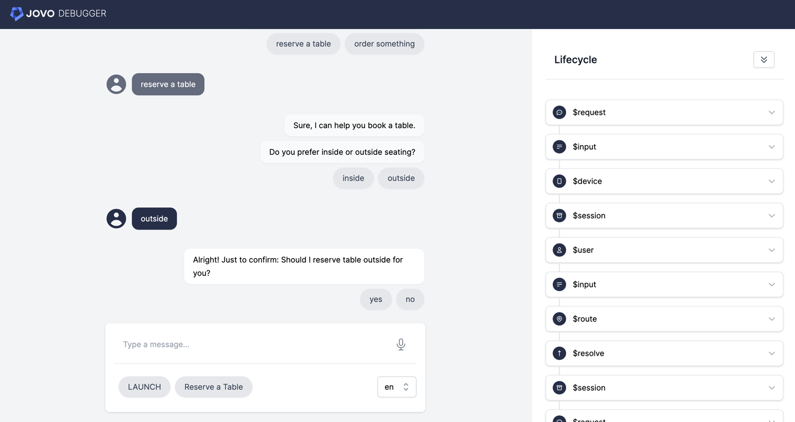

# Jovo Component Sample



<p>
<a href="https://www.jovo.tech" target="_blank">Website</a> -  <a href="https://www.jovo.tech/docs" target="_blank">Docs</a> - <a href="https://www.jovo.tech/marketplace" target="_blank">Marketplace</a> - <a href="https://github.com/jovotech/jovo-v4-template" target="_blank">Template</a>   
</p>

This [Jovo `v4`](https://www.jovo.tech) sample app showcases the following features:

- Navigating between components using `$redirect`, `$delegate`, and `$resolve`
- Using different entry points to reach a component (for example using a global intent or `START` via `$redirect`)
- Using the `if` property of the `@Handle` decorator to see if entities are recognized correctly
- Using `this.$component.data` for component-scoped data that is removed after the component resolves

## Getting Started

Clone this repository and install all dependencies:

```sh
# Clone project
$ git clone https://github.com/jovotech/jovo-sample-components.git

# Go to directory
$ cd jovo-sample-components

# Install dependencies
$ npm install
```

The easiest way test the project code is to install the [Jovo CLI](https://www.jovo.tech/docs/cli) and use the [`run`](https://www.jovo.tech/docs/run-command) command. Learn more in [Jovo getting started docs](https://www.jovo.tech/docs/getting-started).

```sh
# Install Jovo CLI globally
$ npm install -g @jovotech/cli

# Run local development server
$ jovo run
```

This will compile the code, run the local development server, and print out your individual [Jovo Webhook URL](https://www.jovo.tech/docs/webhook) that you can then use to access the [Jovo Debugger](https://www.jovo.tech/docs/debugger).
